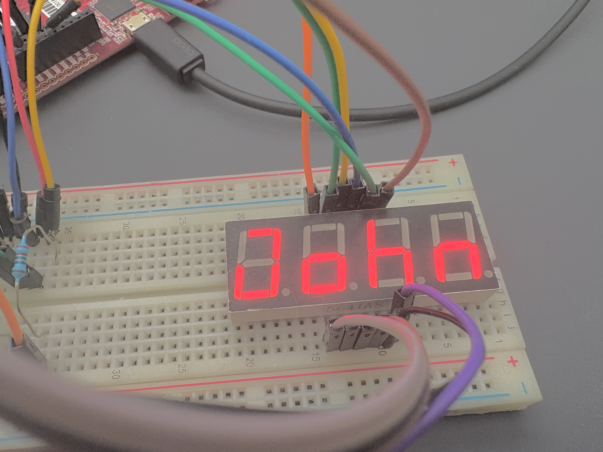
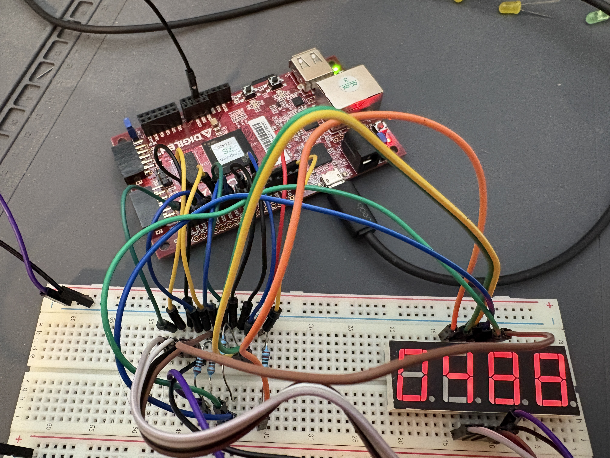
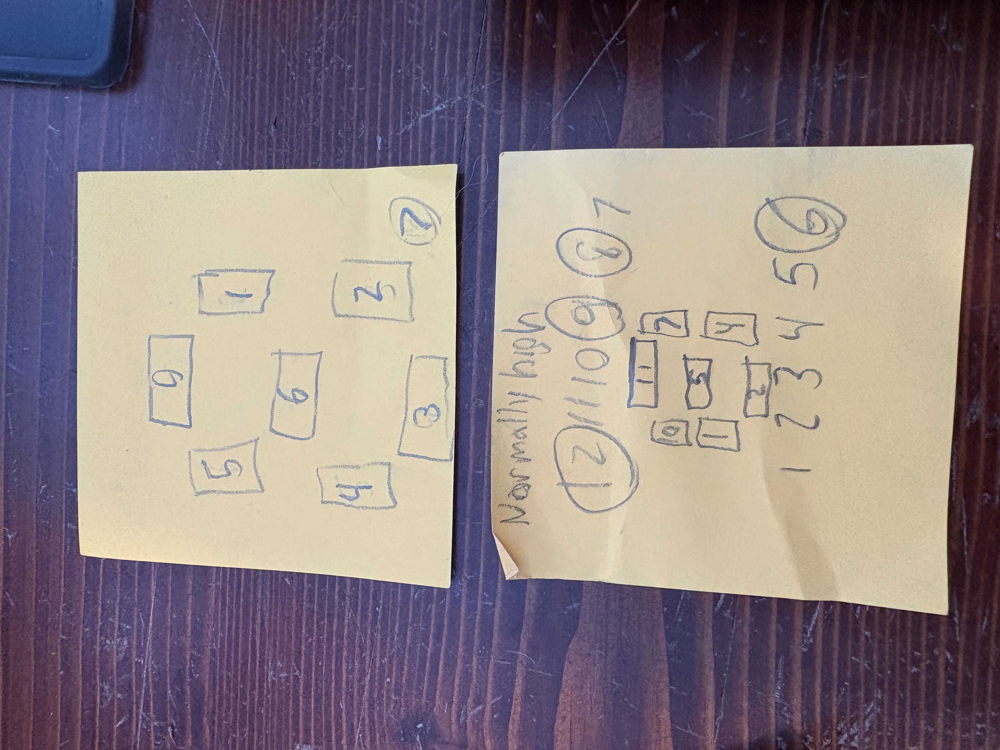
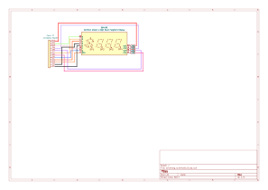

*None of the text or code in this project was written by AI
I used __VHDL By Example_  by Blain Readler as a reference
This was a simple project I did as an introduction to VHDL. I wrote two VHDL files with the accompanying constraints file. 
The first spells out my name "John" on the display as shown below.

The second file is a stopwatch-style counter with accuracy down to a centisecond. One button resets the counter and the other stops it.

With the common anode configuration, the bus called digit is used to select one digit at a time by setting it low, using a FSM to cycle through the four digits quickly.
The picture below shows both the pin connections and which segment each of the bits in the 8 bit bus correspond to. I also included a wiring diagram.

